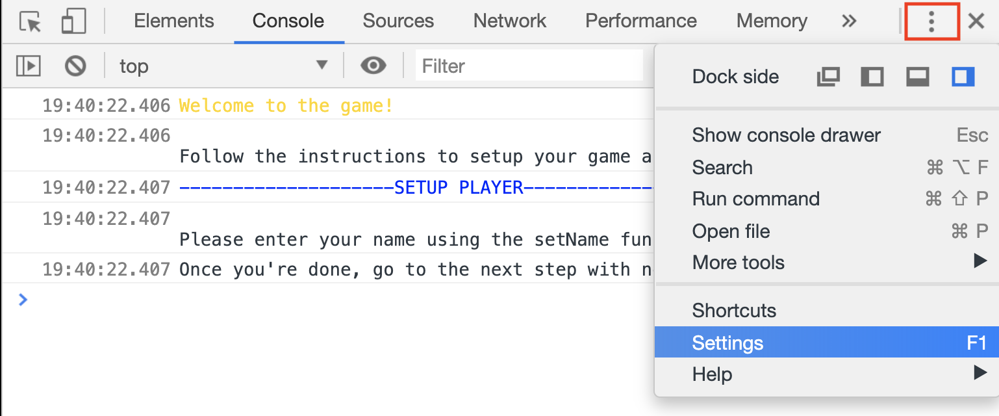
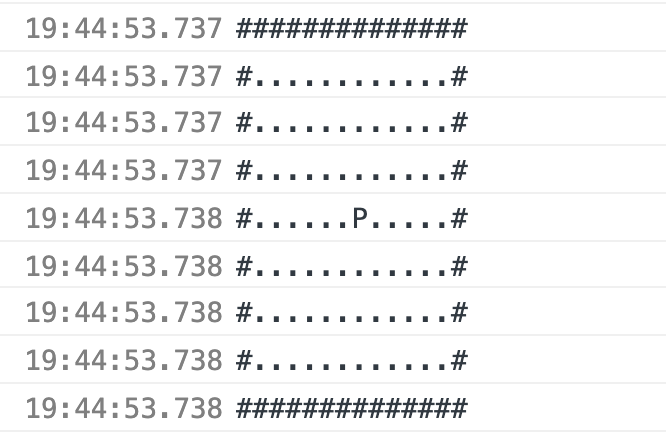

# Javascript project

The goal of this project is to create a console based game in which you are an adventurer on a board game.  
The adventurer can move in 4 directions (Up, Down, Left, Right) and interact with different entities (Monster, Tradesman, Item, Dungeon).

# Game rules

## Entities

Entities are the board game objects that are either simple static elements such as walls & grass or entities like monsters, the tradesman, the player.

All entities have at least 2 properties: a type (string representing entity type) and a position (object representing board position) property.  
These are the different types:

- player
- item
- monster
- tradesman
- dungeon
- grass (symbol is '.')
- wall (symbol is '#')

A position object has 2 properties:

- row: a number representing the index of the board row
- column: a number representing the index of the board column

### Player

The player has the following properties (parentheses has type and initial value)

- name (string)
- level (number - 1)
- items (array of objects - [])
- skills (array of objects - [])
- attack (number - 10)
- speed (number - 3000)
- hp (number - 100)
- gold (number - 0 to start. Can get gold by selling items to the tradesman)
- exp (number - 0 to start. Experience points, increase when slaying monsters)
- type (string - 'player')
- position (object - can be left out and set when needed)
- getMaxHp (function - a method that returns max hp. Value is level \* 100, e.g. level 2 -> 200 max hp)
- levelUp (function - a method to update the level and the different properties affected by a level change. Level up happens when exp >= [player level * 20])
- getExpToLevel (function - a method returning exp required to level. Value is level \* 20, e.g. level 2 -> 40exp required)

When leveling up, exp must be decreased by the amount used to level up, e.g. exp required to level up = 100. current exp = 120  
-> levelUp is called, incrementing by 1 the level and updating exp to exp = 120 - 100 = 20

### Player level rules

The level of the player impacts certain properties of the player.

- hp: max is level \* 100 (e.g. level 1 -> max is 100hp)
- speed: 3000 / level (as level increases, speed gets smaller and thus faster. Speed is in ms, 0 would be instant attack)
- attack: level \* 10 (increases with level)

### Player skills

Skills have the following properties

- name (string)
- requiredLevel (number - the skill should not be useable if player level is lower)
- cooldown (number - initial value is 0 meaning it's useable, over 0 means we have to wait. This gets updated to the cooldown value when skill is used and gradually decreases until it's back to 0)
- use (function - takes a target / entity as a parameter and uses the skill on it)

2 skills to implement: confuse and steal  
confuse:

- required level is 1
- cooldown is 10000
- use: expects a target as parameter and reverses the name of the target entity as well as dealing [player level \* 25] damage (e.g. level 1 -> deals 25hp)

steal:

- required level is 3
- cooldown is 25000
- use: expects a target as parameter and steals all items of rarity 1 or lower (i.e. unusual or common). Stolen items should be added to the player and removed from the target entity.

### Items

Items have the following properties

- name (string - Use the rarity name + type. Example for type 'potion' and rarity 0 -> Common potion)
- type (string - type of item)
- value (number)
- rarity (number - refer to the RARITY_LIST variable)
- use (function - expects a target as parameter to specify on which target to use the item)

2 types of objects to implement:  
potion:

- name: 'Common potion' (if rarity 0)
- type: 'potion'
- value: 5
- rarity: 0
- use: restores 25hp to the specified target

bomb:

- name: 'Common bomb' (if rarity 0)
- type: 'bomb'
- value: 7
- rarity: 0
- use: deals 50hp damage to the specified target

You can tweak the properties and make more item objects

Bonus:  
Potion with rarity 3 restores 100% hp (sets hp back to max hp)  
Bomb with rarity 3 deals 90% damage of hp

### Monsters

Monsters have the following properties (parentheses has type and initial value)

- name (string - random from list of monster names)
- level (number - specified in parameters)
- hp (number - max is level \* 100)
- attack (number - level \* 10)
- speed (number - 6000 / level)
- items (array of objects - may be empty or not depending on parameters)
- position (object - specified in parameters)
- type (string - 'monster')
- getMaxHp (function - a method that returns max hp. Value is level \* 100, e.g. level 2 -> 200 max hp)
- getExp (function - returns exp received for defeating monster. Value is level \* 10 e.g. level 2 -> 20 exp points received)

### Tradesman

Tradesman has the following properties (parentheses has type and initial value)

- name (string - can be anything)
- hp (number - Infinity)
- items (array of objects - may be empty or not depending on parameters)
- position (object - specified in parameters)
- type (string - 'tradesman')
- getMaxHp (function - a method that returns max hp. For tradesman it's Infinity)

When the player and tradesman have the same position it is possible to buy an item from the tradesman or sell an item. Each item has a value property which is the amount of gold necessary to buy the item. It's also the amount of gold a player receives when selling an item. Higher rarity items should have higher value.

### Dungeon

Dungeon has the following properties (parentheses has type and initial value)

- position (object - specified in parameters)
- type (string - 'dungeon')

### Battle rules

When a player and a monster have the same position, each starts to attack indefinitely at an interval specified by their speed property until either the player moves to a different position or one of the entities hp goes to 0. The damage dealt is specified by the attack property.

## Useful functions

- Math.floor
- Math.random
- setInterval
- setTimeout
- clearInterval
- clearTimeout
- Object.keys
- Object.values

All the array methods

## Notes

Use timestamps to avoid having the web browser collapsing your console output:  
Bad

Good

